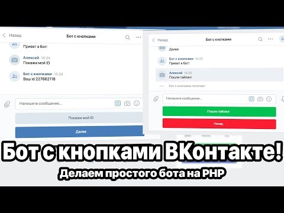

# simple PHP demo chat bot
---
## Require
* PHP >= 7.1  
* Yours webhosting or local hosting (such are OpenServer, Xampp, Denwer and other)  
* **SSL is strongly required!**  
> if you launch without this, you need install PHP >= 7.1[^1]  

## Install

### Step 1
git clone https://github.com/stels-cs/demo-bot.git  demo-bot  
php composer.phar install or download VK_PHP_SDK[^2]

### Step 2
a) Create Public|Group page in vk.com  
b) Manage community -> messages -> Community messages: enable  
c) Settings -> API usage -> Access Token: create token (you will need it for const VK_TOKEN in index.php, line 4)  
d) Settings -> API usage -> Callback API -> Server settings -> url: enter your domain (with https), like https://1809a98d.ngrok.io ( for example used ngrok[^3] )  
> NOTE: you must verify your's server: to do this, he must send comeback string, specified below    *{ "type": "confirmation", "group_id": yours_group_id }*   
and press confirm button  

e) then, in Settings -> API usage -> Callback API -> Event types select all you need  

Done
---
[API for chat-bots](https://vk.com/dev/bots_docs)  

[^1]: https://metanit.com/web/php/1.2.php
[^2]: https://vk.com/dev/PHP_SDK
[^3]: https://ngrok.com